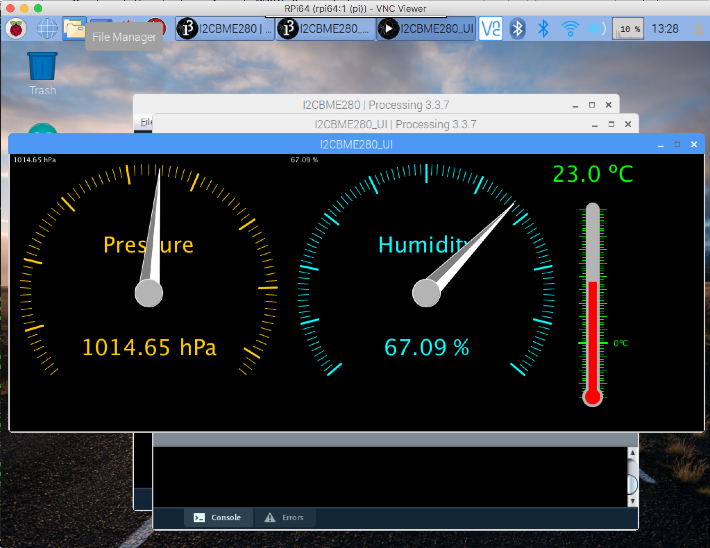
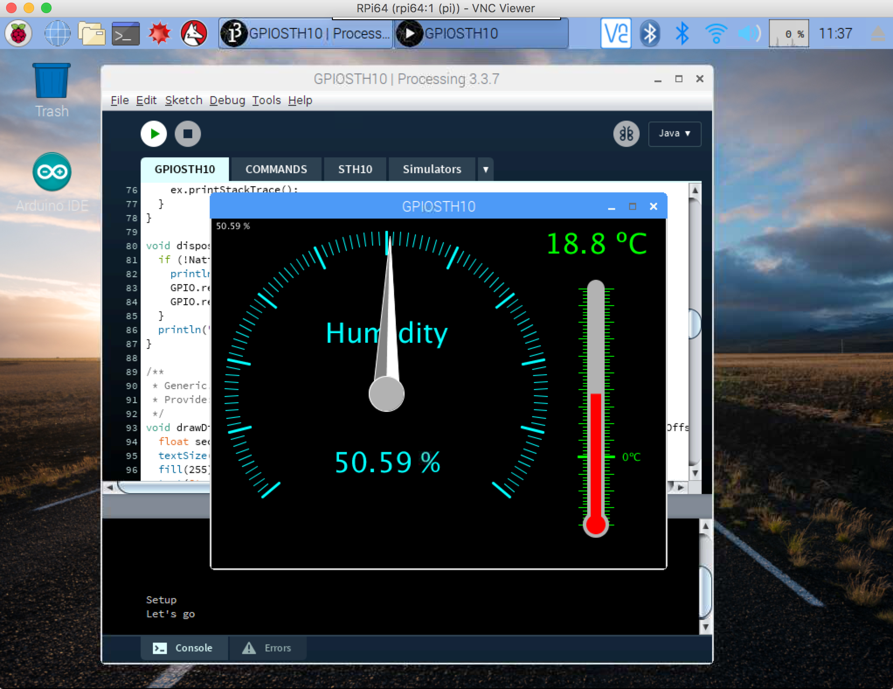

## Hardware-IO examples to provide

- [BME280](https://www.adafruit.com/product/2652), I<small><sup>2</sup></small>C sensor, Temperature, Pressure, Humidity. &#9989; Done
- [BME280](https://www.adafruit.com/product/2652), I<small><sup>2</sup></small>C sensor, Temperature, Pressure, Humidity, with analog displays. &#9989; Done
- [BMP180](https://www.adafruit.com/product/1603), I<small><sup>2</sup></small>C sensor, Temperature, Pressure
- [LSM303](https://www.adafruit.com/product/1120), I<small><sup>2</sup></small>C sensor, magnetometer, accelerometer
- [STH10](https://www.adafruit.com/product/1298), temperature and humidity sensor.  &#10140; WIP
- Enhanced [SSD1306](https://www.adafruit.com/product/3527) (I<small><sup>2</sup></small>C). &#9989; Done
- Mixing [MCP3008](https://www.adafruit.com/product/856) and [SSD1306](https://www.adafruit.com/product/3527) (SPI & I<small><sup>2</sup></small>C). &#9989; Done
- [ADS1x15](https://www.adafruit.com/product/1083), I<small><sup>2</sup></small>C ADC.  &#10140; WIP
- [MeArm](https://shop.mime.co.uk/collections/mearm/products/mearm-your-robot-nuka-cola-blue?variant=4766020165) robotic arm, using an I<small><sup>2</sup></small>C [PCA9685](https://www.adafruit.com/product/815) Servo board.
- ...

##### Recipes
- [How to Remote Debug a Processing Applet](./remote.debug/RemoteDebug.md)

#### Small Notes
On MacOS, in `build/build.xml`, change
```xml
  <property name="jdk.update" value="144" />
```
Other systems:
```xml
  <property name="jdk.update" value="172" />
```

## Wiring Diagrams
#### BME280


#### SSD1306


#### MCP3008 & SSD1306


#### STH10


## Screenshots
### BME280




### SSD1306


### MCP3008 & SSD1306
)


### STH10


---
