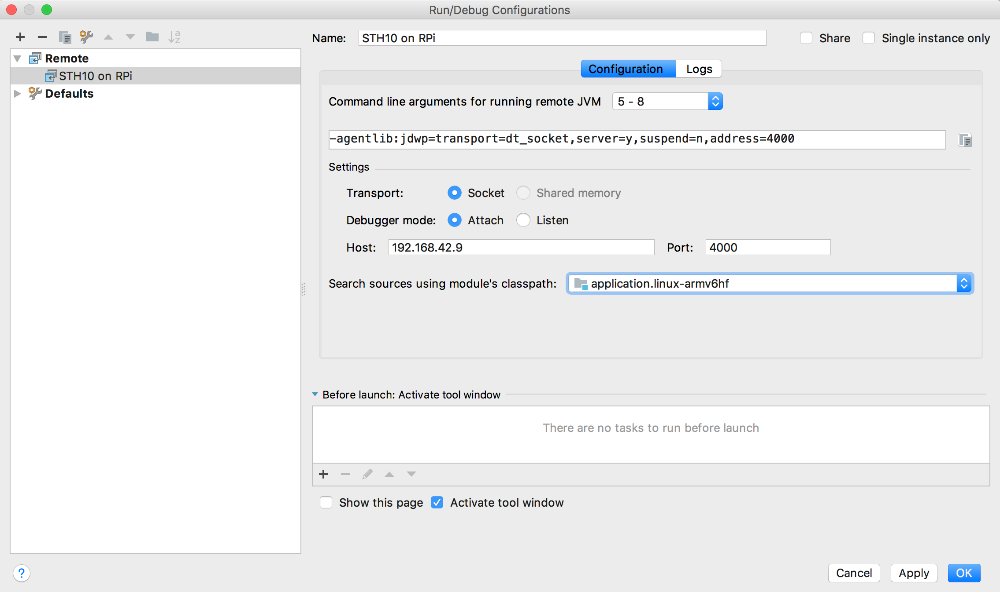
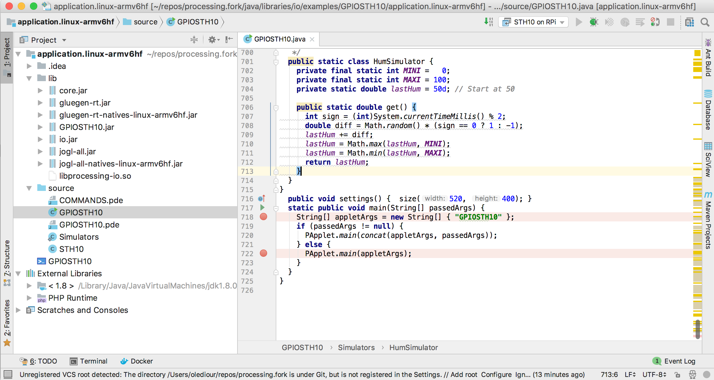
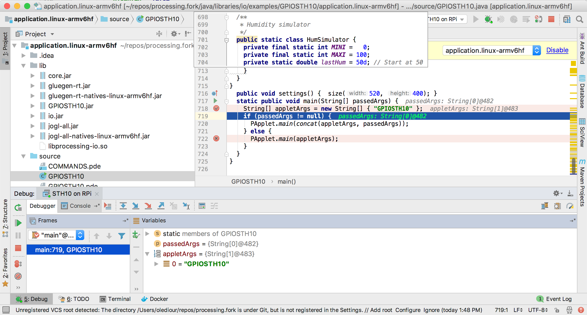

# Remote Debug a Processing Applet

Many Integrated Development Environments (IDE) have nice debugging features, but they are way too big
to run on a Raspberry PI.

Here we want to use an IDE like IntelliJ to remote debug the sketch at `GPIOSTH10`.

### On the Raspberry PI
On the Raspberry PI, in the Processing Development Environment (PDE),
open the sketch to debug (GPIOSTH10 here), and in the menu, choose
`File > Export Application...`. On a Raspberry PI, for the platform, choose `Linux`.

After a little while, a window pops up, showing the generated artifacts, several directories have been generated, like
```
 application.linux-arm64
 application.linux-armv6h
 application.linux32
 application.linux64
```

Open the directory `application.linux-armv6h`, and see the launching script,
named here `GPIOSTH10`, as expected. Edit it:
```bash
#!/bin/sh

APPDIR=$(readlink -f "$0")
APPDIR=$(dirname "$APPDIR")
java -Djna.nosys=true -Djava.library.path="$APPDIR:$APPDIR/lib" -cp "$APPDIR:$APPDIR/lib/GPIOSTH10.jar:$APPDIR/lib/core.jar:$APPDIR/lib/jogl-all.jar:$APPDIR/lib/gluegen-rt.jar:$APPDIR/lib/jogl-all-natives-linux-armv6hf.jar:$APPDIR/lib/gluegen-rt-natives-linux-armv6hf.jar:$APPDIR/lib/io.jar" GPIOSTH10 "$@"
```

To remote debug it, we need to add some options to the `java` command:
```
  JAVA_OPTIONS="$JAVA_OPTIONS -client -agentlib:jdwp=transport=dt_socket,server=y,address=4000"
```
> Notice the port, `4000`. It will have to match your options on the remote debugger.

The script becomes:
```bash
#!/bin/sh

APPDIR=$(readlink -f "$0")
APPDIR=$(dirname "$APPDIR")
JAVA_OPTIONS="$JAVA_OPTIONS -client -agentlib:jdwp=transport=dt_socket,server=y,address=4000"
java $JAVA_OPTIONS -Djna.nosys=true -Djava.library.path="$APPDIR:$APPDIR/lib" -cp "$APPDIR:$APPDIR/lib/GPIOSTH10.jar:$APPDIR/lib/core.jar:$APPDIR/lib/jogl-all.jar:$APPDIR/lib/gluegen-rt.jar:$APPDIR/lib/jogl-all-natives-linux-armv6hf.jar:$APPDIR/lib/gluegen-rt-natives-linux-armv6hf.jar:$APPDIR/lib/io.jar" GPIOSTH10 "$@"
```
Save it.

You can also take a look at the files in the `source` folder.
Notice the `GPIOSTH10.java`, next to `GPIOSTH10.pde`.
The `GPIOSTH10.java` has been generated by Processing, this is the code we will
use for remote-debugging. Notice that this is not a sketch, this is a Java class, extending `PApplet`.

### On the Remote Debugger
The Remote Debugger is the machine where the IDE (like IntelliJ) is running.
This machine and the Raspberry PI need to be on a network where they can see each other.

On the remote debugger, upload the folder `application.linux-armv6h`, and open it in your IDE.
Make sure the libraries in the `lib` folder are associated with your classpath (this opration depends on the IDE you are using,
IntelliJ, Eclipse, NetBeans..., they all have a different way to do this).

For me, the project looks like this in IntelliJ:


Now, let's configure the remote debugging part. Again, all IDEs have their own way to do it, but it is usually well documented.
In IntelliJ, you define a `Remote Configuration` like this:



> Notice:
> - the address of the Raspberry PI on your network, `192.168.42.9` in this case
> - The port, `4000`, as defined in the script on the Raspberry PI.

### Let's go!
First, set breakpoints in your code, for the debugger to stop somewhere, once the program is running.

Like here, in the `main` method:



Now, on the Raspberry PI, start the script:
```
 $ ./GPIOSTH10
 Listening for transport dt_socket at address: 4000
```
This means that the program is waiting for the remote debugger to connect

Then, on the remote debugger, in IntelliJ - or your IDE - start the remote debugging session.

You should be all set, you can now do whatever your debugger can do, see variables, change their values,
set all the break points you want, drill into methods...



Happy debugging!

